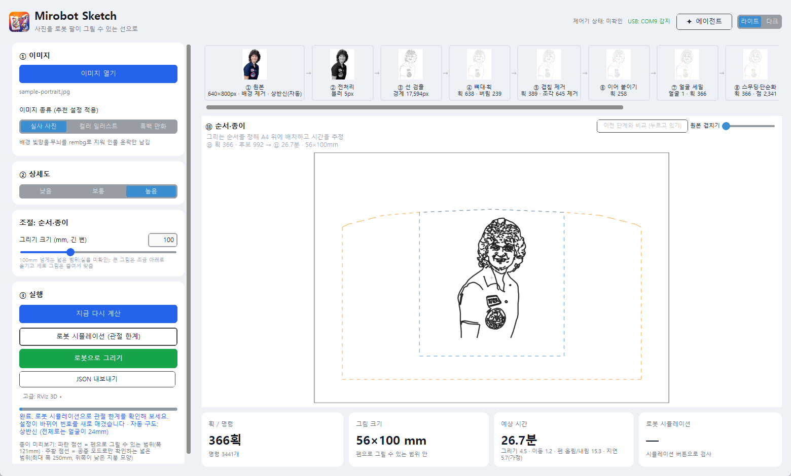
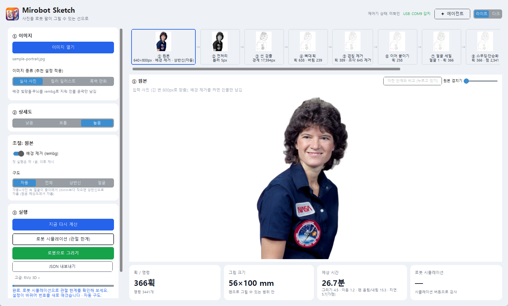
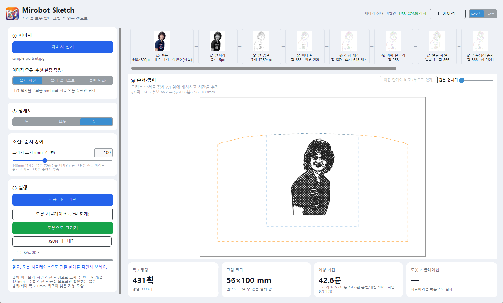
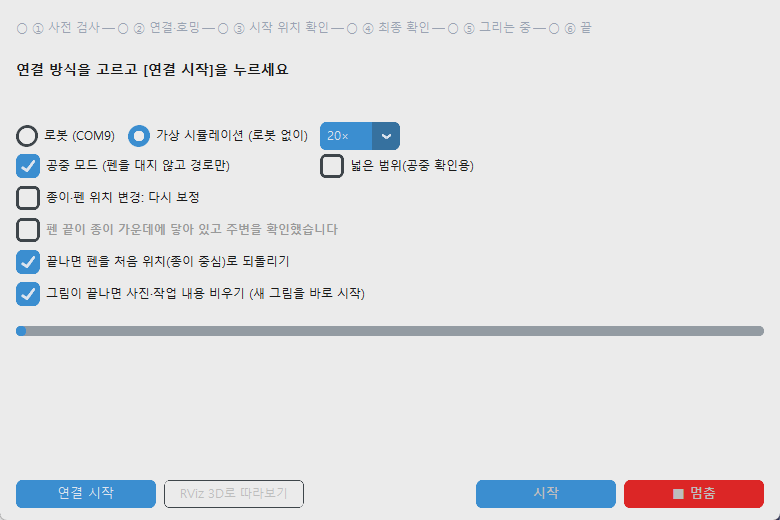
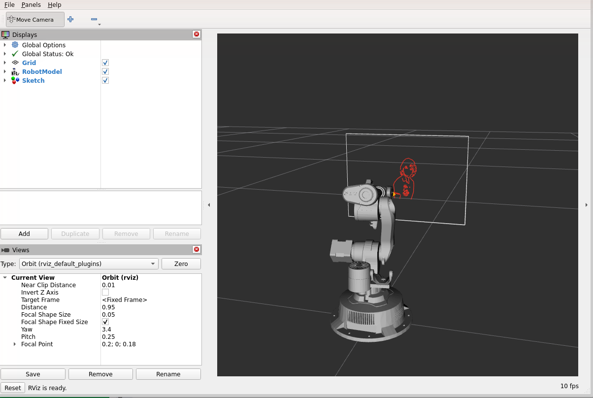
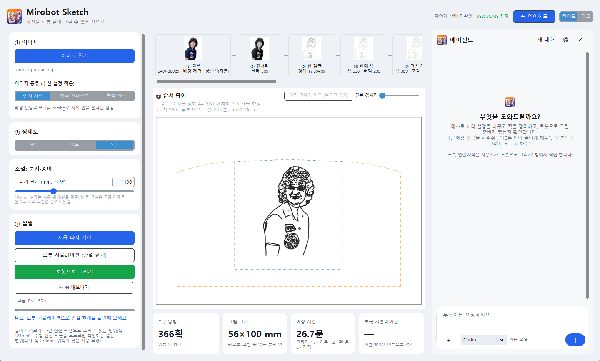

# Mirobot Photo Sketch

[한국어](README.md) | **English**


[](https://github.com/yoobinkim541/OSS-2026-Mirobot-Photo-Sketch/actions/workflows/ci.yml)
[](https://github.com/yoobinkim541/OSS-2026-Mirobot-Photo-Sketch/releases)
[](LICENSE)

An open-source project that turns a photo into line paths with OpenCV and has a [WLKATA Mirobot](https://www.wlkata.com/) robot arm draw them with a pen on an A4 sheet fixed to a wall. You do not need a robot to try the line extraction, the 3D simulation and the virtual simulation.

<p align="center"></p>

```
photo ─▶ line-extraction pipeline ─▶ strokes (paper mm) ─▶ checks (allowed area, joint simulation) ─▶ Mirobot pen drawing
         (OpenCV etc., 11 stages)                                                                     (Windows, USB serial)
                                                            └─▶ (optional) live RViz 3D following (WSL2 + ROS 2)
```

> **The app's on-screen text is currently Korean only**, so the screenshots show a Korean UI. Design and technology choices are described in [docs/ARCHITECTURE.en.md](docs/ARCHITECTURE.en.md). Some deeper notes (work logs in `LOG/`, OpenCV study notes) are in Korean.

## Contents

- [Features](#features)
- [Installation](#installation)
- [Why Ubuntu 22.04 + ROS 2 Humble](#why-ubuntu-2204--ros-2-humble)
- [Usage](#usage)
- [Agent panel](#agent-panel-editing-by-chat)
- [3D simulation](#3d-simulation-check-without-a-robot)
- [Tech stack and design docs](#tech-stack-and-design-docs)
- [Delivery (CI/CD)](#delivery-cicd)
- [Tests · folders · license](#tests)

## Features

- **Photo → line paths:** recommended settings for photos / color illustrations / black-and-white manga, face-detection-based framing and detail, optional background removal, optional tone hatching
- **Stage-by-stage view:** click through 11 stages; changing a value recomputes only from the changed stage
- **Draw with the robot:** a safety flow of pre-check → connect & home → start-position check → human final confirmation → drawing → done, plus a virtual simulation without a robot
- **3D simulation:** joint-limit checks; optionally RViz follows the robot's progress while it draws
- **Agent:** change settings and propose stroke edits through chat (it has no tool that moves the robot)

<table>
<tr>
<td></td>
<td></td>
</tr>
<tr>
<td align="center">Stage strip and large view</td>
<td align="center">Tone hatching level 2</td>
</tr>
<tr>
<td></td>
<td></td>
</tr>
<tr>
<td align="center">Draw-with-robot window</td>
<td align="center">RViz 3D following</td>
</tr>
</table>

The sample photo is a public-domain NASA photo ([credit](THIRD_PARTY_NOTICES.md)).

## Installation

| | Windows 10/11 | Robot | RViz 3D (optional) |
|---|---|---|---|
| Requirements | 64-bit Windows (the .exe installer needs no Python) | WLKATA Mirobot + USB (CH340) cable, A4 paper, pen | Windows 11 + WSL2 (or Ubuntu 22.04) |

Without a robot you can still use line extraction, the simulation and the virtual simulation. RViz 3D is optional.

### Option 1. Installer (.exe, recommended)

Download `MirobotSketch-Setup-X.Y.Z.exe` from [Releases](https://github.com/yoobinkim541/OSS-2026-Mirobot-Photo-Sketch/releases) and run it.

- It creates a **Mirobot Sketch** shortcut in the Start menu (and optionally on the desktop) and can be removed from "Apps & features". No administrator rights are needed.
- Tick **"Also install the RViz 3D environment"** during setup and the 3D environment setup helper opens afterwards (about 400 MB download).
- There is no code signing, so Windows SmartScreen may show an "unknown publisher" warning the first time. Click **More info → Run anyway**.

The config file is created on first run at `%APPDATA%\MirobotSketch\drawing_config.json` and run records accumulate in `runs\` in the same folder. Edit that file for the serial port and calibration values. Background removal (rembg) is not bundled in the .exe because of its size.

### Option 2. zip (no installation)

Unzip `MirobotSketch-vX.Y.Z-windows-x64.zip` from the same release and run `MirobotSketch.exe` (GUI) or `mirobot.exe` (command line: `mirobot draw …`, `mirobot strokes …`, `mirobot sim …`, `mirobot setup-rviz …`).

### Option 3. Developer install (Python 3.10+)

```bash
git clone https://github.com/yoobinkim541/OSS-2026-Mirobot-Photo-Sketch.git
cd OSS-2026-Mirobot-Photo-Sketch
pip install -e .
```

This provides the commands `mirobot-sketch` (GUI), `mirobot-strokes`, `mirobot-draw` and `mirobot-sim`. Running from the repository uses `robot/drawing_config.json`, `LOG/runs/` and `out/` directly. Install extra features only when needed:

| Extra feature | Command |
|---|---|
| Background removal (downloads a ~170 MB model on first run) | `pip install -e ".[rembg]"` |
| Agent panel (MCP, keyring, requests) | `pip install -e ".[agent]"` |
| Build the .exe | `pip install -e ".[build]"`, then `pyinstaller packaging/mirobot_sketch.spec --noconfirm` |

To launch the repository code from shortcuts, run this once (creates desktop and Start-menu shortcuts, no console window; `-Remove` deletes them):

```bash
powershell -ExecutionPolicy Bypass -File packaging/create_shortcuts.ps1
```

### RViz 3D environment (optional: WSL2 + ROS 2 Humble + Mirobot model)

Only needed for the 3D view and live following. Pick whichever method suits you.

**A. Setup helper (recommended, one click)** — downloads a prebuilt image (about 400 MB, about 2 GB after installation) and imports it as the `MirobotSketch-ROS` distribution (about 2 minutes plus download). Your existing WSL distributions are not touched.

- **GUI:** under "③ Run", `Advanced` → [Install / check RViz 3D environment…] → [Install]. If the download is interrupted, [Resume install] continues where it stopped.
- **Command line:** `mirobot setup-rviz --check | --install | --uninstall | --manual | --wsl`
- **Installer:** tick "Also install the RViz 3D environment". Uninstalling the app asks whether to remove the distribution too.
- **PC without WSL:** [Install WSL (admin)] → approve in Windows → reboot → [Install]. Administrator rights are needed just this once and no password is asked for.

**B. Install directly with the shell script** — run in a terminal of Ubuntu 22.04 (WSL2 or Linux):

```bash
git clone https://github.com/yoobinkim541/OSS-2026-Mirobot-Photo-Sketch.git
cd OSS-2026-Mirobot-Photo-Sketch
bash packaging/wsl/setup_ros_env.sh
```

It installs ROS 2 Humble (`ros-base`, `rviz2`, `robot_state_publisher`) and the WLKATA model (`~/mirobot_ws`), skips steps that are already done, and prints `SETUP_OK` on the last line. It asks for the `sudo` password only where needed, and exits unless the system is Ubuntu 22.04 (jammy). The app automatically finds a WSL distribution that has `/opt/ros/humble` and `~/mirobot_ws`; to use another one, set the environment variable `MIROBOT_WSL_DISTRO`.

**C. The helper's fallback path** — if the image cannot be downloaded, [Manual install (fallback)] downloads Ubuntu's official 22.04 WSL root file (about 230 MB, SHA256-verified), imports it as the dedicated distribution `MirobotSketch-ROS` and runs `setup_ros_env.sh --image` inside it. Your existing distributions are untouched, and no password or extra administrator approval is involved.

To replay by hand, export a trajectory and run in WSL2:

```bash
mirobot-sim out/photo.json --export out/photo_traj.json
wsl -d MirobotSketch-ROS -- bash -lc "cd /mnt/c/<repository path> && bash sim/run_rviz.sh out/photo_traj.json 10"
```

## Why Ubuntu 22.04 + ROS 2 Humble

This combination is for the RViz 3D environment and is **not needed to move the robot** (real control runs on Windows directly over USB serial with G-code).

- **ROS 2 Humble is the LTS release for Ubuntu 22.04 (jammy)**, so it installs straight from binary packages on 22.04. The setup script also refuses other releases.
- For the 3D view, `ros-base` + `rviz2` + `robot_state_publisher` + one WLKATA model package are enough — much smaller than a full desktop install.
- WLKATA's official ROS 2 repository is pinned to commit `c0a7ad4` and confirmed to build on this combination. Other combinations (e.g. Ubuntu 24.04 + Jazzy) were not verified.
- The same script runs in a GitHub Actions `ubuntu:22.04` container to produce the image that WSL imports, which is attached to each release.

For the full reasoning and the Windows ↔ WSL connection, see the [design doc](docs/ARCHITECTURE.en.md#6-why-ubuntu-2204--ros-2-humble).

## Usage

### 1. Photo → strokes JSON

GUI (recommended):

```bash
mirobot-sketch            # or python CV/gui_sketch.py
```

A card-style window built with CustomTkinter, with light and dark modes. Open a photo and pick the image type (photo / color illustration / black-and-white manga) to load recommended settings. It previews at real size and pen width on an A4 sheet and also shows the estimated time (drawing, travel, pen up/down, command delay) and the robot simulation result (joint limits PASS/FAIL).

- **Stage strip:** Source → Preprocess → Edges → Skeleton & strokes → De-duplicate → Join strokes → Face detail → Smooth & simplify → Tone hatching → Edit → Order & paper. Clicking a stage switches the large view and the left-hand controls to it.
- **Auto recompute:** 0.3 s after a value changes, only the changed stage and later ones are recomputed (about 0.01 s if only late stages change).
- **Tone hatching (off by default):** outlines alone leave dark hair, clothes and shadows empty, so the impression differs from the photo. Raising "tone level" to 1–3 fills dark areas with parallel hatching (cross-hatched from level 2) and chains consecutive lines in a zigzag without lifting the pen to reduce pen lifts. For photos with a dark background, turn on "Remove background" first; otherwise no hatching is made and a hint is shown. On the microphone photo (background removed), tone similarity rises 0.71 → 0.88 (level 1) → 0.93 (level 2), while estimated time grows 17.8 → 25.1 → 31.2 min. Hatching is not part of the edit numbering and is merged with the outlines when the drawing order is decided.
- **Edge modes:** brightness (grayscale Canny) / color difference (Lab Canny, also finds edges between colors of similar brightness) / dark lines (center lines of line art).
- **Faces:** for photos, OpenCV YuNet finds faces ([model license](THIRD_PARTY_NOTICES.md)).
  - **Auto framing:** if the face is smaller than 25 mm on paper (as in a full-body photo), it crops to the upper body at original resolution. You can also choose full / bust / face under "Framing".
  - **Face detail:** re-finds lines only in the face area at original resolution and merges lines denser than the pen width so they do not smear on paper. Short lines near eyes, nose and mouth are kept.
- **Large view:** wheel to zoom, drag to pan, double-click to fit. "Overlay original" shows the color original through the drawing so you can spot missing lines.
- **Edit stage:** every stroke gets a number (only strokes visible in the zoomed range). Turn on "Discarded lines" to see pieces the pipeline dropped as gray dotted lines with numbers. Edits proposed by the agent are shown in red (disappears) and green (appears); remove number tags in the proposal bar below and then [Apply]. Applied edits survive recomputation after settings change.
- **Draw with the robot:** in the [Draw with robot] window under "③ Run", it goes ① pre-check → ② connect & home → ③ start-position check → ④ final confirmation → ⑤ drawing → ⑥ done. The step bar shows the current step, what to do next and why it stopped. When a drawing finishes, the pen returns to the **start position** (paper center, the start pose with the pen tip lightly touching the paper) (option, on by default; not applicable in air mode), then the photo and working state (strokes, edit history, simulation) are cleared so you can start a new drawing right away (option, on by default; settings such as image type, detail and size are kept). On stop, error or cancel it neither moves nor clears automatically, and an error during the return is reported as is. The return is sent separately after all drawing commands finish, so it does not disagree with the simulation or RViz progress display.
  - The top of the GUI shows whether the configured COM port is recognized over USB and the controller state. The USB indicator only checks the device list; the controller state is updated from responses received on a real drawing connection.
  - You must tick "paper, pen and surroundings checked" to start, and air mode is the default.
  - If you moved the paper or the pen, choose "Paper/pen moved: recalibrate". Otherwise it homes and draws right away using the values saved in the config (`plane_compensation`, `limits`) without calibration. Connecting to the real robot without paper calibration shows "no paper calibration" on the final confirmation screen.
  - The app saves the paper coordinates it sent to `out/run_strokes_*.json` and the run record in `LOG/runs/` points to that file. Real pen-down can only start inside the area whose contact was confirmed by calibration. The wide-range option can be used to check air paths beyond that.
  - **Virtual simulation** (no robot, 1–500× speed) tests the same flow. On the command line: `mirobot draw <json> --execute --virtual`.
  - On a PC with WSL2 + ROS 2, **RViz follows the robot's progress (command replies) in real time** while it draws.

Command line:

```bash
mirobot-strokes photo.jpg --type photo --out out/photo
```

- `--type photo|illustration|manga` : recommended settings per image type (`mirobot_sketch/presets.py`)
- `--detail low|medium|high` : detail level. Lower means fewer strokes and less drawing time.
- `--rembg` / `--no-rembg` : background removal (results are cached in `out/cache/`)
- `--median 11` : removes small patterns such as manga screentone dots.
- `--dedupe 4` : merges double lines closer than the pen width (the two edges of a thick line) into one (default 4 px, 0 = off)
- `--merge 4` : joins strokes whose end points meet to reduce pen lifts (default 4 px, 0 = off)
- `--lines dark` : draws the center lines of dark strokes in clean line art.
- `--box W H` : drawing box size in mm. The default is 100 × 100.

This creates `out/photo.json` and a comparison image `out/photo_preview.png` (input / line candidates / strokes / drawing order).

### 2. Strokes JSON → robot

```bash
mirobot-draw out/photo.json
```

The default is a **dry run**: the robot does not move and only a G-code file and a summary are produced. Before drawing for real, prepare the following.

1. Power on, hold the center button for 2 seconds to home, and confirm the Idle state.
2. Put the pen tip at the center of the paper.
3. Check the port, center TCP and signs in `robot/drawing_config.json`.

When ready, run:

```bash
mirobot-draw out/photo.json --execute
```

Results are saved in `LOG/runs/`. The first time, check left/right and up/down orientation with `trajectories/orientation-test-F.json`.

- `--air` : follow the same path without touching the paper (to check reach and collisions).
- `--pending-limits` : check against the not-yet-verified wide area (a roof-shaped region fitted to the reach map: left/right ±125 · down −85 · up +42.5 to +57.5 mm). Used for the range test (`trajectories/border-test-wide.json`) and large drawings.

**Drawing larger:** "Drawing size" in the GUI can go up to 250 mm. This is one side of the width/height box and the photo's aspect ratio is kept. For example a landscape photo set to 120 mm gives roughly a 120×71 mm drawing. To fit the wide area, large drawings are shifted slightly down and tall drawings are shrunk to the upper limit. The wide area is for checking the robot's air moves and the simulation; to draw with the pen you must calibrate the contact area of the whole drawing on the real robot. Follow `_limits_pending_note` in `robot/drawing_config.json` and the [log](LOG/2026-09-26-bigger-drawing.md) (Korean) for the hardware procedure.

#### Paper plane and drawing-area calibration

After a person sets the gap between paper and wall, the front/back (X) offset and the plane tilt are computed from contact coordinates at the center and the four corners of a rectangle. The robot has no contact sensor, so a person judges pen-tip contact by eye. It runs without a webcam. Calibration never starts automatically: it guides you before drawing only when requested by choosing "Recalibrate" in the GUI or with `mirobot-draw --execute --calibrate`. Even when drawing without calibration, the allowed-area (`limits`) check, the start-position check and the human final confirmation still apply, so drawings outside `limits` cannot be drawn with the pen and only air mode works. The virtual simulation skips the calibration procedure.

When you pick a drawing with an extended range in the GUI, the app follows a rectangle around the drawing's coordinates plus a 1 mm margin in pen-up, asking for confirmation at each corner. Then you confirm contact at the four corners yourself to calibrate the width and height that drawing needs. For example a 120×71 mm photo checks an area of about 122×74 mm. If contact is not confirmed, real pen-down does not start.

Because of the upper reach limit (+55 to 57.5 mm above the paper center), large drawings are placed below the paper center. A 120×120 mm drawing spans −65 to +55 mm vertically, and calibration measures the four corners of that range (relative to the paper center, symmetric left/right). If this area passes, the execution limit is stored as that rectangle (`x_max_mm`, `y_min_mm`, flat upper limit). In theory a square up to about 138 mm fits in the robot's reach (simulation PASS). However, if the measured plane residual exceeds 1 mm (the paper is warped or away from the wall), the configuration is not changed, so fix the paper flat and measure again.

```bash
python -m mirobot_sketch.calibration             # only shows the expected search range
python -m mirobot_sketch.calibration --execute    # real calibration
# After reinstalling the package, the mirobot-calibrate [--execute] command is also available.
```

Connecting power and USB and running this opens the serial connection once (the controller restarts). Home with the center button, then set and fix the paper center and gap. It starts from a 60×60 mm rectangle in pen-up and grows each side by 10 mm. At each corner, check there is no interference and continue with `Enter`. `c` picks the current completed size (the previous safe size while expanding) and `q` cancels. At the four corners of the chosen rectangle, `+`/`-` adjust the X axis by 0.25 mm; for example `++++++++` is a 2 mm move toward the wall. Record with `Enter` right when the pen tip just touches, and do not press hard enough to leave a mark on the paper.

The configuration is updated only if the maximum plane residual over the five contact points is 1 mm or less. When it passes, the center TCP, the plane compensation and the confirmed square limit are saved to `robot/drawing_config.json` and the full measurements are kept in `LOG/calibrations/`. If the deviation is large or the user aborts, the existing configuration is kept. Recalibrate if the robot port or the installation position changes.

## Agent panel (editing by chat)

<p align="center"></p>

The **✦ Agent** button at the top right of the GUI opens a chat panel. Say things like "too many strokes, finish within 15 minutes", "remove background noise" or "keep the hair outline more", and the agent looks at the original and the stage results itself, then changes settings or **proposes** edits. Proposals appear in the edit stage in red/green with numbers, and you can instruct by number, e.g. "apply without number 5". Changes are reflected in the left-hand settings and the preview immediately.

| Backend | Preparation |
|---|---|
| **Claude Code** | Install Claude Code and log in with `claude`. The app runs `claude -p` and connects the app's tools as an MCP server. |
| **Codex** | Install the Codex CLI and log in. The app runs `codex exec`. |
| **OpenRouter** | Enter the API key in the panel's ⚙ settings (stored in the Windows Credential Manager). The default model is `anthropic/claude-opus-5`, and you can choose among models that support tool calls and images. |

The tools the agent uses are: view state, view images (original / stage results / edit / paper), change settings, list strokes, view point coordinates, compare photo and drawing (`compare`: original | drawing | difference image with tone-similarity and outline-reproduction metrics), propose edits (delete, keep, move point, delete point, insert point, smooth, cut, join, draw short line), apply/discard proposals, undo, simulate, and the **robot readiness check (`robot_guide`)**. `robot_guide` is read-only: it tells you whether this drawing is inside the range the pen can draw, whether the simulation passed, whether paper calibration exists, and the order a person follows in the "Draw with robot" window. **There is no tool that moves, connects or starts the robot.** A person must confirm and start real drawing in the app's "Draw with robot" window (when handing over to the command-line executor, export the JSON and type `yes`), and while drawing the agent can only read, not change settings or edits.

To use the agent in a development environment, install the needed packages (mcp, keyring, requests) with `pip install -e ".[agent]"`.

## 3D simulation (check without a robot)

It solves Mirobot kinematics (IK) along the same path as the executor and checks whether joint limits (soft limits) are exceeded.

```bash
mirobot-sim out/photo.json --plot out/joints.png --gif out/sim.gif
mirobot-sim --reach-map out/reach_map.png
```

With the RViz 3D environment installed, `Advanced` → [View in RViz 3D] in the GUI plays the trajectory on the robot-arm model, and while drawing it follows the command replies. Install it by following the [procedure above](#rviz-3d-environment-optional-wsl2--ros-2-humble--mirobot-model).

## Tech stack and design docs

| Area | Used |
|---|---|
| Image processing | [OpenCV](https://opencv.org/) (Canny, median, morphology, `approxPolyDP`, YuNet face detection), [scikit-image](https://scikit-image.org/) (`skeletonize`), [NumPy](https://numpy.org/), [SciPy](https://scipy.org/) |
| Background removal | [rembg](https://github.com/danielgatis/rembg) (optional) |
| UI | [CustomTkinter](https://github.com/TomSchimansky/CustomTkinter) |
| Robot communication | [pyserial](https://github.com/pyserial/pyserial) — USB serial G-code |
| 3D visualization | [ROS 2 Humble](https://docs.ros.org/en/humble/) + [RViz](https://github.com/ros2/rviz) + WLKATA's official URDF (WSL2 Ubuntu 22.04) |
| Agent | [MCP](https://modelcontextprotocol.io/), Claude Code / Codex CLI / OpenRouter |
| Packaging and delivery | [PyInstaller](https://pyinstaller.org/), [Inno Setup](https://jrsoftware.org/isinfo.php), GitHub Actions |

What was chosen for each stage and why, the OpenCV functions used, the Windows ↔ WSL2 bridge design and the packaging are in **[docs/ARCHITECTURE.en.md](docs/ARCHITECTURE.en.md)**.

## Delivery (CI/CD)

- **CI** (`.github/workflows/ci.yml`): on every push to main and every PR, runs tests and the command-line tools on Windows/Ubuntu × Python 3.11/3.13.
- **CD** (`.github/workflows/release.yml`): pushing a `v*` tag builds the Windows .exe, checks it works using the built exe, then uploads a zip and an installer to GitHub Releases. The same release also gets the RViz 3D environment image (a WSL root file built by the setup script in an `ubuntu:22.04` container, with ROS and the model verified, plus its SHA256).
- **Dependabot** (`.github/dependabot.yml`): opens weekly PRs for updates to Actions and dependencies.

Releasing a new version:

```bash
git tag -a v0.3.0 -m "..." && git push origin v0.3.0
```

Also bump `__version__` in `mirobot_sketch/__init__.py`.

## Tests

```bash
python -m unittest discover -s tests -v
```

## Folders

| Path | Content |
|---|---|
| `mirobot_sketch/` | Python package: CV pipeline, paper coordinates, executor, simulator, GUI (`data/` holds default config, icon, face model) |
| `mirobot_sketch/agent/` | Agent: tool definitions, chat backends (OpenRouter / Claude Code / Codex), MCP server, local bridge, chat panel |
| `CV/` | Repository entry files (`gui_sketch.py`, `make_strokes.py`); `experiments/` holds learning-stage scripts |
| `robot/` | Robot config (`drawing_config.json`), repository executor entry point, early serial/gripper/pump test code |
| `sim/` | Repository simulator entry point, RViz playback (WSL2 ROS 2) |
| `packaging/` | PyInstaller build config, installer (Inno Setup), WSL ROS-environment setup script (`wsl/`) |
| `.github/workflows/` | CI (tests), Release (builds the .exe and image on tag push) |
| `assets/` | App icon, README screenshots and the sample photo |
| `trajectories/` | Shape templates and test paths |
| `docs/` | Design doc ([ARCHITECTURE](docs/ARCHITECTURE.en.md)), OpenCV study notes |
| `LOG/` | Dated work logs and run records (Korean) |
| `tests/` | Regression tests |

## Environment notes

- Real control uses pyserial on Windows. A CH340 port passed through to WSL2 by USB passthrough does not return responses.
- Opening a serial port anew resets the board. While running, make sure no other program opens the same port.
- ROS 2 Humble (WSL2) is used only for the RViz 3D view. ROS is not used for robot control.

## License

[MIT](LICENSE). The origin and license of the bundled third-party files (the YuNet model and the sample photo) are in [THIRD_PARTY_NOTICES.md](THIRD_PARTY_NOTICES.md).

Started as a term project for Open Source Programming (2026-2).
