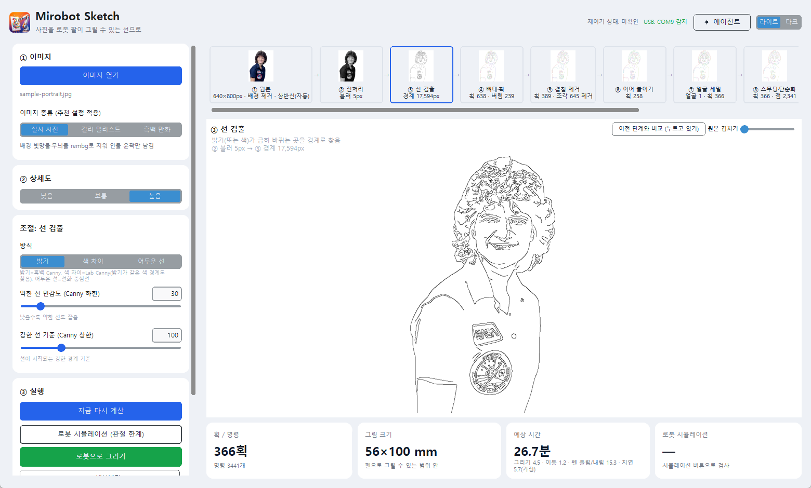
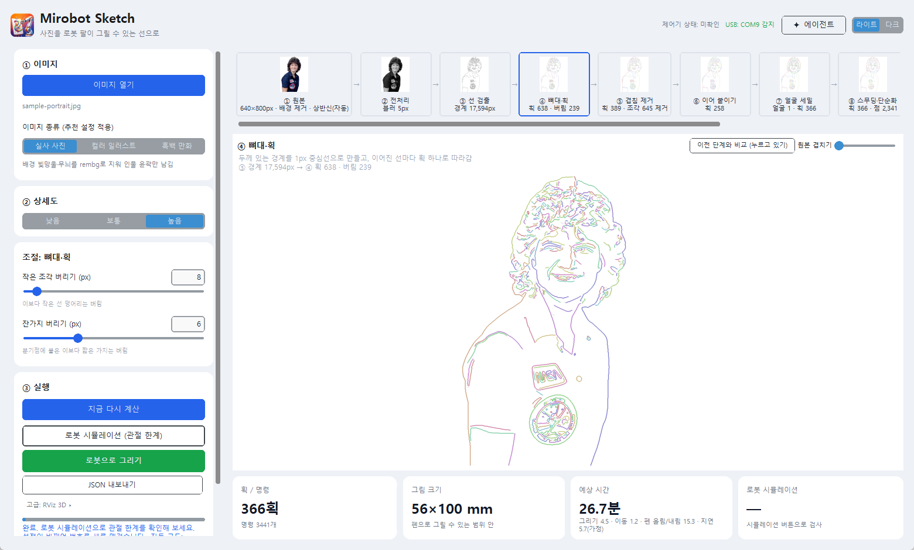
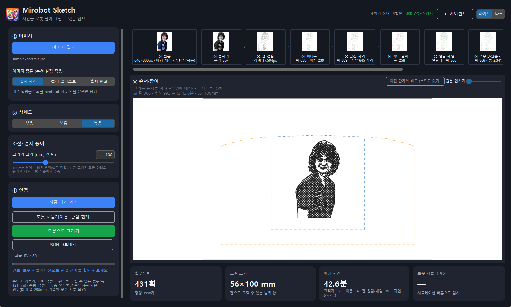

# Design and Technology Choices

[한국어](ARCHITECTURE.md) | **English** · [← README](../README.en.md)

This document explains **how Mirobot Sketch works**, **which libraries, technologies and open-source projects each stage uses and why**, and **how Windows and WSL2 are connected**. Installation and usage are in the [README](../README.en.md).

> Note: the app's on-screen text is currently **Korean only**, so the screenshots below show a Korean UI.

## Contents

1. [Overall structure](#1-overall-structure)
2. [Photo → strokes pipeline (technology per layer)](#2-photo--strokes-pipeline-technology-per-layer)
3. [OpenCV functions used](#3-opencv-functions-used)
4. [Paper coordinates and pre-flight checks](#4-paper-coordinates-and-pre-flight-checks)
5. [Running the robot (DrawJob)](#5-running-the-robot-drawjob)
6. [Why Ubuntu 22.04 + ROS 2 Humble](#6-why-ubuntu-2204--ros-2-humble)
7. [How ROS relates to robot control](#7-how-ros-relates-to-robot-control)
8. [The WSL2 ↔ Windows bridge](#8-the-wsl2--windows-bridge)
9. [Packaging and distribution](#9-packaging-and-distribution)
10. [UI](#10-ui)
11. [Agent](#11-agent)
12. [Known limitations](#12-known-limitations)
13. [Open-source projects used](#13-open-source-projects-used)

---

## 1. Overall structure

```
                  Windows (app and robot control)                              WSL2 Ubuntu 22.04 (3D view, optional)
┌──────────────────────────────────────────────────────┐        ┌───────────────────────────────────────┐
│ photo ─▶ line-extraction pipeline ─▶ strokes (paper mm)│       │ ROS 2 Humble                           │
│          (OpenCV, scikit-image, ...)                  │        │  robot_state_publisher ─▶ RViz2        │
│            │                                          │        │  rviz_playback.py (markers, joints)    │
│            ▼                                          │        │        ▲                               │
│  checks: allowed area · URDF kinematics (IK) simulation│ files │        │ reads                         │
│            │                                          │ ─────▶ │  joint-trajectory JSON + progress file │
│            ▼                                          │ /mnt/c │   (written by Windows, read by WSL)    │
│  DrawJob (①–⑥) ── G-code + "ok" replies ──▶ USB serial │       └───────────────────────────────────────┘
│            │                                  │       │
│            └─ progress file, on every "ok" ───┘       │
└──────────────────────────────┬───────────────────────┘
                               ▼
                       WLKATA Mirobot (pen)
```

Three key decisions:

- **The app and the real-robot control stay on Windows.** The GUI, the USB serial port (CH340) and the installer are simplest on Windows, and a USB serial port passed through to WSL2 did not return responses.
- **ROS 2 is used only for 3D visualization.** There is no ROS in the real-robot control path ([section 7](#7-how-ros-relates-to-robot-control)).
- **The two sides are connected with files.** No sockets and no ROS bridge: Windows writes JSON and WSL reads it ([section 8](#8-the-wsl2--windows-bridge)).

## 2. Photo → strokes pipeline (technology per layer)

A photo passes through the stages below and becomes a **list of strokes in paper millimeters**. Every stage is cached (key = previous key + stage + parameters), so changing a value recomputes only from the changed stage onward. The stage definitions are in [`mirobot_sketch/stages.py`](../mirobot_sketch/stages.py).

| Source | Edge detection | Skeleton & strokes | Order & paper (A4 layout) |
|:-:|:-:|:-:|:-:|
|  |  |  |  |

(Sample photo: a public-domain NASA photo, [credit](../THIRD_PARTY_NOTICES.md))

| # | Stage | What it does | Technology | Why |
|---|---|---|---|---|
| ① | Source | Normalizes the long side to 800 px, optional background removal, framing (full / bust / face) | [OpenCV](https://opencv.org/) `resize`, `imdecode`; [rembg](https://github.com/danielgatis/rembg) (U²-Net-family model on ONNX Runtime) | Parameters in pixels must not depend on the photo's resolution. rembg keeps just the person in one call and runs on CPU. The model and runtime are large (about 170 MB+), so it is an optional install and is left out of the .exe |
| ② | Preprocess | Grayscale, blur, median filter (removes manga screentone dots) | OpenCV `cvtColor`, `GaussianBlur`, `medianBlur` | Less fine texture means fewer stray lines later. The median filter works well on dot patterns |
| ③ | Edges | Finds places where brightness changes sharply. Three modes: brightness / color difference (Lab) / dark lines (Otsu) | OpenCV `Canny`, `cvtColor` (Lab), `threshold` (Otsu), `morphologyEx` | Canny gives thin, continuous edges that suit a pen path. Lab catches edges between colors of equal brightness; Otsu catches the center line of clean line art |
| ④ | Skeleton & strokes | Thins thick edges to a 1 px center line, then walks the pixel graph and splits it into one stroke per connected line | [scikit-image](https://scikit-image.org/) `skeletonize`, [NumPy](https://numpy.org/), OpenCV `connectedComponentsWithStats` | `findContours` walks both sides of a thin line and **draws the same line twice** (a 280 px line gave a 559 px outline). A stroke that visits each center line once fits a pen |
| ⑤ | De-duplicate | Merges double lines closer than the pen width | [SciPy](https://scipy.org/) `cKDTree` | The two edges of a thick line smear together on paper. A KD-tree makes nearest-neighbor search fast |
| ⑥ | Join strokes | Joins strokes whose end points touch to reduce pen lifts | NumPy | Pen up/down moves take a large share of the total time |
| ⑦ | Face detail | Finds faces, re-traces them at original resolution and re-densifies to the pen width | OpenCV **YuNet** (`FaceDetectorYN`, [OpenCV Zoo](https://github.com/opencv/opencv_zoo/tree/main/models/face_detection_yunet), MIT) | The model is tiny (one ONNX file) and runs through a built-in OpenCV API, so no separate deep-learning framework is needed. MIT license allows redistribution |
| ⑧ | Smooth & simplify | Removes staircase jitter, reduces points (= robot commands), rounds corners | Gaussian smoothing, OpenCV `approxPolyDP` (Douglas–Peucker) | Fewer points mean shorter, faster G-code. Douglas–Peucker is the standard shape-preserving simplifier |
| ⑨ | Tone hatching | Fills dark areas with parallel hatch lines (cross-hatched at higher levels) and chains consecutive lines in a zigzag | OpenCV `GaussianBlur`, `morphologyEx`, `dilate`, NumPy | Outlines alone leave hair, clothes and shadows empty, so the impression differs from the photo. Zigzag chaining reduces pen lifts. It costs time, so it is off by default |
| ⑩ | Edit | Numbered strokes; review and apply keep / delete / point-edit proposals | Own implementation | People and the agent share one edit model. Applied edits survive when settings change and the pipeline recomputes |
| ⑪ | Order & paper | Orders strokes (nearest end point first), lays them out on A4 and estimates time | NumPy, own implementation | A greedy nearest-neighbor order shortens pen-up travel. Simple, fast and predictable |

| No tone hatching | Tone hatching level 2 |
|:-:|:-:|
|  |  |

Tone hatching raises similarity to the photo (tone correlation). On the microphone photo with background removal it goes 0.71 → 0.88 (level 1) → 0.93 (level 2), while the estimated time grows 17.8 → 25.1 → 31.2 min (metrics from the `compare` tool).

## 3. OpenCV functions used

The project depends on `opencv-python>=4.8`. These are the functions the code actually calls:

| Purpose | Functions |
|---|---|
| Read / write (safe for non-ASCII paths) | `imdecode`, `imencode` |
| Resize and color conversion | `resize`, `cvtColor` (BGR↔Gray/Lab), `convertScaleAbs` |
| Noise removal | `GaussianBlur`, `medianBlur` |
| Edge detection | `Canny`, `threshold` (Otsu), `morphologyEx`, `getStructuringElement`, `dilate` |
| Analysis | `connectedComponentsWithStats`, `findContours` (comparison only), `arcLength` |
| Simplification | `approxPolyDP` (Douglas–Peucker) |
| Faces | `FaceDetectorYN` (YuNet) |
| Previews and display | `polylines`, `line`, `circle`, `ellipse`, `rectangle`, `drawMarker`, `putText`, `applyColorMap` |

Why `findContours` is not the default is explained in the stage ④ row above (only the comparison function `extract_strokes_contour()` is kept). Study notes are in [`docs/opencv-study`](opencv-study/) (Korean).

## 4. Paper coordinates and pre-flight checks

- **Paper coordinates:** the pixel → paper-mm transform (`pixels_to_paper`) and the size/position decision live in `paper_mapping.py` and `session.py`. Large drawings are placed below the paper center because of the robot's upper reach limit.
- **Allowed area (`limits`):** a real pen-down can only start inside the configured area. Anything outside is air mode only.
- **Kinematics simulation:** the same G-code path as the executor is split into 1 mm steps, **inverse kinematics (IK)** is solved at each, and joint limits are checked ([`mirobot_sim.py`](../mirobot_sketch/mirobot_sim.py)).
  - The joint structure and limits are copied from the URDF (`wlkata_mirobot_description.urdf`) of WLKATA's official ROS 2 repository.
  - At the home pose, the URDF and the controller-reported TCP differ by 24.52 mm along the flange direction. Using that as a tool offset makes forward kinematics match the controller within 1 µm.
  - A damped least-squares IK with a finite-difference Jacobian is implemented in NumPy. Batched computation plus a warm start extrapolated from the previous two points made it **3.2–3.6× faster** (58.8 s → about 18 s, joint-angle difference ≤ 1e-5 rad).
- **Paper-plane calibration (optional):** five pen-contact points give the front/back (X) offset and the tilt by least squares. If the plane residual exceeds 1 mm, the configuration is not changed. It never starts automatically, only on request.

## 5. Running the robot (DrawJob)

`DrawJob` ([`draw_job.py`](../mirobot_sketch/draw_job.py)) runs the steps below in a worker thread; the GUI only receives status through a UI queue.

```
① pre-check → ② connect & home → ③ start-position check → ④ final confirm (human) → ⑤ drawing → ⑥ done
```

<p align="center"></p>

- **Communication:** G-code (`M20 G90 G01 X Y Z A B C F`) is sent one line at a time over USB serial (pyserial), waiting for `ok`. Opening the port resets the board through the CH340, so the connection is opened once and reused, and homing is done by a person with the hardware button (no automatic homing command is sent).
- **Pen approach:** the pen descends fast until a clearance height above the paper and slowly for the last stretch (`pen.up_clearance_mm`, `pen.slow_zone_mm`).
- **Safety flow:** a problem anywhere in ①–④ means it does not start and the port is closed. In ④ the person must tick "paper, pen and surroundings checked" before [Start] is enabled, and the port is always closed even on stop or cancel.
- **After finishing:** the pen returns to the start position (paper center) and the working state is cleared. On stop, error or cancel nothing moves automatically.
- **Virtual simulation:** tests the same flow without a robot. It imitates homing, per-command delay, errors and timeouts, at 1–500× speed.
- **Records:** run records go to `LOG/runs/` (the user folder for installed builds). Absolute paths such as the user's home folder are replaced by a repo-relative path or the file name when saving.

## 6. Why Ubuntu 22.04 + ROS 2 Humble

This combination is for the **3D view (RViz)**. It is not needed to move the robot.

- **They are a matched pair.** ROS 2 Humble Hawksbill is the long-term-support (LTS) release that targets Ubuntu 22.04 (jammy), and its binary packages (`ros-humble-*`) are published for 22.04. So `packaging/wsl/setup_ros_env.sh` refuses to run on anything but jammy (exit code 3).
- **Install only what is needed.** RViz needs `ros-base` + `rviz2` + `robot_state_publisher` + one WLKATA model package. That is far smaller than a full desktop install (several GB).
- **A verified combination.** WLKATA's ROS 2 repository is pinned to commit `c0a7ad4` and confirmed to build here (only the `textures` folder missing from the official repository is supplied). Other distributions (for example Ubuntu 24.04 + Jazzy) were not verified.
- **It can be built as a reproducible image.** The same script runs in a GitHub Actions `ubuntu:22.04` container and produces a root-filesystem image (about 401 MB) that WSL can import.
- **WSL2 is enough.** WSLg opens the Linux GUI window (RViz) directly on Windows 11.

## 7. How ROS relates to robot control

| | Real-robot control | 3D visualization |
|---|---|---|
| Runs on | Windows | WSL2 Ubuntu 22.04 |
| Transport | USB serial, G-code | ROS 2 topics (`/joint_states`, markers) |
| Uses ROS | **No** | ROS 2 Humble (rviz2, robot_state_publisher) |

- **Why serial G-code without ROS:** the app is a Windows program that already owns the GUI and the USB serial port. Going through ROS would add layers (such as USB passthrough to WSL), and real control only needs a "send a line → wait for ok" procedure. So the controller's G-code interface is used directly.
- **What is taken from ROS 2:** only the **URDF and 3D meshes** from WLKATA's official ROS 2 repository. This model (1) shows the arm in 3D in RViz and (2) provides the joint structure and limits for the kinematics simulation in [section 4](#4-paper-coordinates-and-pre-flight-checks).
- **No ROS path planning (e.g. MoveIt).** The app builds the path directly from paper coordinates and checks joint limits with its own IK simulation.
- **The RViz playback node (`rviz_playback.py`):** a small ROS 2 Python node that publishes joint states (`/joint_states`) and markers for paper, pen and ink trace. `robot_state_publisher` computes the model's transforms from the URDF and the joint states for RViz.

## 8. The WSL2 ↔ Windows bridge

The Windows app launches RViz in WSL2 and hands over progress while drawing so that RViz follows the robot.

### 8.1 Launching: Windows → WSL

- `wsl.exe -d <distro> -- bash -lc "<command>"` runs `sim/run_rviz.sh` inside WSL with no console window ([`rviz_launch.py`](../mirobot_sketch/rviz_launch.py)).
- **Finding the distro:** it reads the list from `wsl -l -q` (UTF-16LE output), skips docker-desktop and picks a distro that has `/opt/ros/humble` and `~/mirobot_ws`. The app's own distro `MirobotSketch-ROS` comes first, and the environment variable `MIROBOT_WSL_DISTRO` can override it. If ROS is missing it does not launch and points to the setup helper.
- **Path conversion:** Windows paths become `/mnt/c/...`, quoted if they contain spaces.
- **The RViz window:** WSLg shows it on the Windows desktop. Closing it makes `run_rviz.sh` also stop the playback and state publisher (starting again also cleans up old processes).

### 8.2 Data: two files

| File | Written by | Read by | Content |
|---|---|---|---|
| Joint-trajectory JSON | Windows (simulation result) | WSL `rviz_playback.py` | Per-point joint angles, G-code command number (`cmd`), per-command feed rate |
| Progress file (JSON) | Windows `DrawJob` (on every `ok`) | WSL `rviz_playback.py --follow` | State (homing/running/stopped/done/error), acknowledged commands, total commands |

- **Why files:** WSL2 can read Windows files directly under `/mnt/c`, so no sockets, port forwarding or ROS bridge are needed. There is no coupling between processes, so one side dying does not affect the other, and two files are easy to debug.
- **Atomic writes:** the progress file is written to a temporary file and swapped in with `os.replace`, so the reader never sees half a JSON. If antivirus or the reader briefly holds the file on Windows, the write is retried.
- **A failed write must not stop drawing:** the progress file is auxiliary. If writes keep failing it never raises, records `last_error` and shortens retries so real drawing is not slowed.
- **Standard library only:** `live_progress.py` is also imported by WSL's ROS Python, so it uses only the standard library. The installed build ships this file and the playback script as data.

### 8.3 Follow-position estimate

The controller replies `ok` per command, so commands **up to the last `ok` are treated as confirmed**, and after that the position is interpolated at the expected speed but **never past the end of the next command** (`FollowTrack`). If the controller buffers commands, `ok` can arrive before the move finishes, so the display may run ahead of the real arm. A correction value (`display_lag_s`) is reserved to be tuned on the real robot, and reading the real position via a status query (`?`) is planned if needed (unverified).

### 8.4 Problems we hit

| Symptom | Cause | Fix |
|---|---|---|
| RViz window appears transparent (`[WARN:COPY MODE]`) | WSLg passes the window by copying | Restart WSLg with `wsl --shutdown`; default to software rendering (`LIBGL_ALWAYS_SOFTWARE=1`, GPU via `MIROBOT_RVIZ_GPU=1`) |
| `$'\r': command not found` | Script saved with CRLF on Windows | Pin `*.sh` to LF in `.gitattributes` |
| No commands sent for 10 s after [Start] | Launching RViz blocked the drawing thread while WSL woke up | Launch RViz in a separate thread; RViz catches up from the progress file |
| Playback keeps running after closing RViz | Playback script was separate | `run_rviz.sh` waits for RViz and cleans up with it; also cleans old processes on start |
| CLI crashes on a Korean console (cp949) | Unprintable symbols | `safe_console()` replaces unprintable characters with `?` |

### 8.5 Setup helper

For PCs without WSL or a ROS environment, [`rviz_setup.py`](../mirobot_sketch/rviz_setup.py) re-checks three steps every time (① WSL feature ② RViz environment ③ verification) and provides what is missing.

- It resumes the release image (about 401 MB) with `Range` requests, verifies SHA256, unpacks it and imports it with `wsl --import MirobotSketch-ROS`. Existing distros are left untouched.
- It checks free disk space before downloading and reports "not enough space" separately from "corrupt".
- The only step needing administrator rights is `wsl --install --no-distribution`; no password is handled.
- If the image cannot be downloaded, a fallback builds a dedicated distro from Ubuntu's official 22.04 root file (SHA256-verified) and runs `setup_ros_env.sh --image` inside it.

## 9. Packaging and distribution

### 9.1 Python package

- Shared code lives in the `mirobot_sketch/` package with relative imports. The entry files in `CV/`, `robot/` and `sim/` are thin wrappers that keep the old commands working.
- `pyproject.toml` (setuptools ≥ 77, MIT license metadata) defines dependencies and the commands (`mirobot-sketch` (GUI), `mirobot-strokes`, `mirobot-draw`, `mirobot-sim`, `mirobot-setup-rviz`, `mirobot-calibrate`), with optional extras `[rembg]` (background removal), `[agent]` (agent) and `[build]` (PyInstaller).
- **File locations** are decided in one place, [`paths.py`](../mirobot_sketch/paths.py). Running from the repository uses `robot/drawing_config.json`, `LOG/runs/` and `out/`; an installed build or the .exe uses `%APPDATA%\MirobotSketch\` (the default config is copied from inside the package). The environment variable `MIROBOT_CONFIG` can point at a config file directly.

### 9.2 Windows .exe (PyInstaller)

- [`packaging/mirobot_sketch.spec`](../packaging/mirobot_sketch.spec): a **one-folder (onedir)** build. `MirobotSketch.exe` (GUI, no console) and `mirobot.exe` (command line: `draw`, `strokes`, `sim`, `setup-rviz`, `mcp`) sit in one folder.
- **Why onedir instead of onefile:** faster start and fewer antivirus false positives.
- rembg and onnxruntime are excluded for size, and the build runs in a clean build-only virtual environment. The RViz playback script, the setup script and the face model are bundled as data.
- Because sub-commands import modules by string name, hidden imports are declared with `collect_submodules`.

### 9.3 Installer (Inno Setup)

- [`packaging/installer.iss`](../packaging/installer.iss): installs into the user folder with no administrator rights; creates Start-menu and (optional) desktop shortcuts and an uninstaller, shows the MIT license page, and offers Korean and English setup screens.
- A fixed AppId makes a newer version upgrade the old one. The optional task "Also install the RViz 3D environment" opens the setup helper after installation.
- An explicit AppUserModelID keeps the taskbar from grouping the app under the Python icon.
- There is no code signing, so SmartScreen may show an "unknown publisher" warning.

### 9.4 Why Docker is not used

The app needs a GUI window and a USB serial port. Docker on Windows runs inside a virtual machine and needs extra setup for both (WSLg/X server, usbipd), stacking one more layer on top of the CH340-in-WSL2 problem. Docker is used only in the **release CI that reproduces the ROS environment**.

### 9.5 CI/CD (GitHub Actions)

- **CI** ([`ci.yml`](../.github/workflows/ci.yml)): on every push to main and every PR, runs the tests and the command-line tools on Windows/Ubuntu × Python 3.11/3.13. Branch protection requires these four checks before merging into main.
- **Release** ([`release.yml`](../.github/workflows/release.yml)): pushing a `v*` tag
  1. on Windows: tests → PyInstaller build → **check draw/sim/virtual run with the built exe** → build the Inno Setup installer → **silently install, run and uninstall on the runner** → upload the zip and Setup.exe to the release;
  2. in a separate job: builds the ROS environment image in an `ubuntu:22.04` container with `setup_ros_env.sh --image`, verifies ROS, the model and `robot_state_publisher`, and uploads it with its SHA256 (size must be ≤ 1900 MB).
- **Dependabot:** opens weekly PRs for Actions and pip dependency updates.

## 10. UI

<p align="center"></p>

- Built with **[CustomTkinter](https://github.com/TomSchimansky/CustomTkinter)**: a card-style layout with light and dark modes.
- **Why CustomTkinter:** it gives a modern look on top of Python's standard Tk with few dependencies and is easy to bundle with PyInstaller. Real desktop products often use Qt (PySide6) or web technology (Electron/Tauri), but this project's core is image processing and the robot pipeline, so time went into distribution and reproducibility rather than rewriting the UI.
- **Responsiveness:** heavy work (pipeline, simulation, robot I/O) runs in worker threads and results go through a UI queue. To keep the simulation from starving the UI because of the Python GIL, the thread switch interval is reduced (`sys.setswitchinterval`). Tk objects are only cleaned up on the main thread.
- **Auto recompute:** 0.3 s after a value changes, only the changed stage and later ones are recomputed.

| Dark mode | Agent panel |
|:-:|:-:|
|  |  |

## 11. Agent

The ✦ Agent panel in the GUI helps change settings and edit strokes through chat. It has **no tool that moves the robot.**

- **Tools:** view state, view images (source / stages / edit / paper), change settings, list strokes and coordinates, compare photo and drawing (`compare`), propose edits (delete, keep, move point, cut, join, …), apply/discard proposals, undo, simulate, and a read-only robot readiness check (`robot_guide`).
- **Backends:** Claude Code CLI (`claude -p`), Codex CLI (`codex exec`) and the OpenRouter API. The CLI backends reach the app's tools through an **[MCP](https://modelcontextprotocol.io/) server**; API keys are stored with [keyring](https://github.com/jaraco/keyring) in the Windows Credential Manager.
- **Why MCP:** CLI agents that are already logged in can use the same tools, and the app is not tied to one model API.
- **Safety:** while drawing (`drawing_lock`) only read tools are allowed. A person starts real drawing from the "Draw with robot" window.

## 12. Known limitations

- **Not verified on hardware:** the real line quality and time of tone-hatched drawings, whether an ink dot is left at the paper center when the pen returns to the start position, pen contact beyond 120 mm, whether the agent's models use the new tools well, and the real-world left/right sign (`paper_x_to_robot_y_sign`).
- **Paper plane:** if the paper is not perfectly flat, contact is uneven (the calibration residual gate is 1 mm).
- **No collision checking:** collisions of the arm or pen holder with the wall or paper are not checked.
- **3D view requires** a PC with WSL2 + ROS 2 Humble. Without it, only the built-in robot simulation (joint-margin check) works.
- **Display lag:** `ok` can arrive before a move finishes, so RViz may run ahead of the real arm.
- **UI language:** Korean only.

## 13. Open-source projects used

| Area | Projects |
|---|---|
| Image processing | [OpenCV](https://opencv.org/), [OpenCV Zoo YuNet](https://github.com/opencv/opencv_zoo) |
| Imaging and numerics | [NumPy](https://numpy.org/), [SciPy](https://scipy.org/), [scikit-image](https://scikit-image.org/), [Pillow](https://python-pillow.org/), [Matplotlib](https://matplotlib.org/) |
| Background removal | [rembg](https://github.com/danielgatis/rembg) (optional) |
| UI | [CustomTkinter](https://github.com/TomSchimansky/CustomTkinter) |
| Robot communication | [pyserial](https://github.com/pyserial/pyserial) |
| 3D visualization | [ROS 2 Humble](https://docs.ros.org/en/humble/), [RViz](https://github.com/ros2/rviz), [robot_state_publisher](https://github.com/ros/robot_state_publisher), [WLKATA Mirobot ROS 2](https://github.com/wlkata/Wlkata_Mirobot_Ros2) (URDF and meshes) |
| Agent | [MCP Python SDK](https://github.com/modelcontextprotocol/python-sdk), [keyring](https://github.com/jaraco/keyring), [requests](https://requests.readthedocs.io/), [OpenRouter](https://openrouter.ai/), Claude Code, [Codex CLI](https://github.com/openai/codex) |
| Packaging and delivery | [PyInstaller](https://pyinstaller.org/), [Inno Setup](https://jrsoftware.org/isinfo.php), [GitHub Actions](https://docs.github.com/actions), [Dependabot](https://docs.github.com/code-security/dependabot) |
| Runtime environment | [WSL2 / WSLg](https://learn.microsoft.com/windows/wsl/), Ubuntu 22.04 |

See each project's repository for its license. The origin and license of the third-party files shipped in this repository (the YuNet model and the sample photo) are in [THIRD_PARTY_NOTICES.md](../THIRD_PARTY_NOTICES.md).
